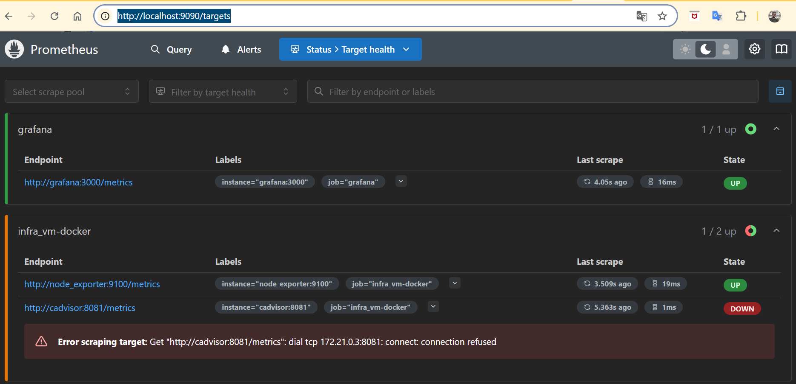

In this Project, we will focus on Performance monotoring of our architecture Apps and follow their health in real-time.
Monotoring is a too important branch as part of `DataOps` and particularly of `Ops`.

NB: Default ``username and password`` is ``admin`` for first grafana connection ID.
Some ideas to design your grafana dashboard [here](https://grafana.com/grafana/dashboards/):

To survey on :

- [Node-exporter](https://grafana.com/grafana/dashboards/1860-node-exporter-full/) : ``Node Exporter Full``
- [kube cluster](https://grafana.com/grafana/dashboards/13332-kube-state-metrics-v2/) : ``kube-state-metrics-v2``
- [K8s/Storage/Volumes/Cluster](https://grafana.com/grafana/dashboards/11454-k8s-storage-volumes-cluster/) : ``K8s / Storage / Volumes / Cluster``
- [kubernetes Nodes](https://grafana.com/grafana/dashboards/8171-kubernetes-nodes/) : ``Kubernetes Nodes``
- [K8S Dashboard](https://grafana.com/grafana/dashboards/15661-k8s-dashboard-en-20250125/) : ``K8S Dashboard EN 20250125``
- [RabbitMQ-Overview](https://grafana.com/grafana/dashboards/10991-rabbitmq-overview/) : ``RabbitMQ-Overview``
- [RabbitMQ-queues](https://grafana.com/grafana/dashboards/11340-rabbitmq-quorum-queues-raft/) : ``RabbitMQ-Quorum-Queues-Raft``
- [RabbitMQ-stream](https://grafana.com/grafana/dashboards/14798-rabbitmq-stream/) : ``RabbitMQ-Stream``
- [MongoDB](https://grafana.com/solutions/mongodb/visualize/?pg=dashboards&plcmt=featured-dashboard-2) : ``Visualize your MongoDB data``
- [Kubernetes Monitoring](https://grafana.com/solutions/kubernetes/?pg=dashboards&plcmt=featured-dashboard-1) : ``Kubernetes Monitoring``

Others:
Nom	| ID	| Description |
----|-----| -----------|
Docker and system monitoring |	179	 | Stats Docker + host server |
Kubernetes cAdvisor Metrics	| 13619	| special Kubernetes |
Docker Containers Metrics	| 12308	| Metrics Details per container |

Check whether a [prometheus scraping operate well or fail](http://localhost:9090/targets).

And we can see what happens:

We can also see below an overview of monotoring with grafana that visualize data scraped by prometheus from difference data sources defined in ``prometheus.yml`` file.

Let download and watch: [📹 Watch video](assets/videos/prometheus-grafana-operating.mp4).
